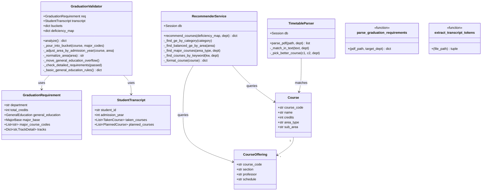
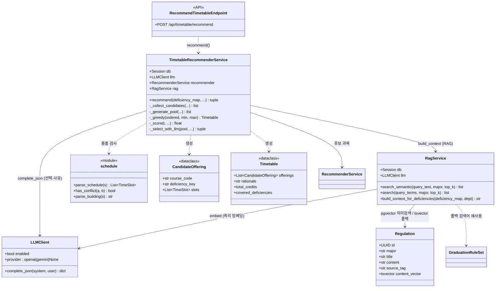
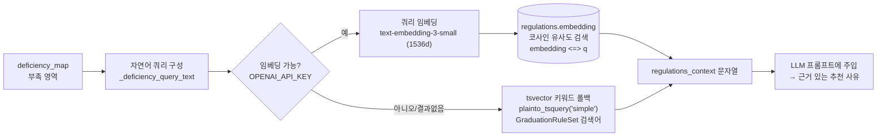
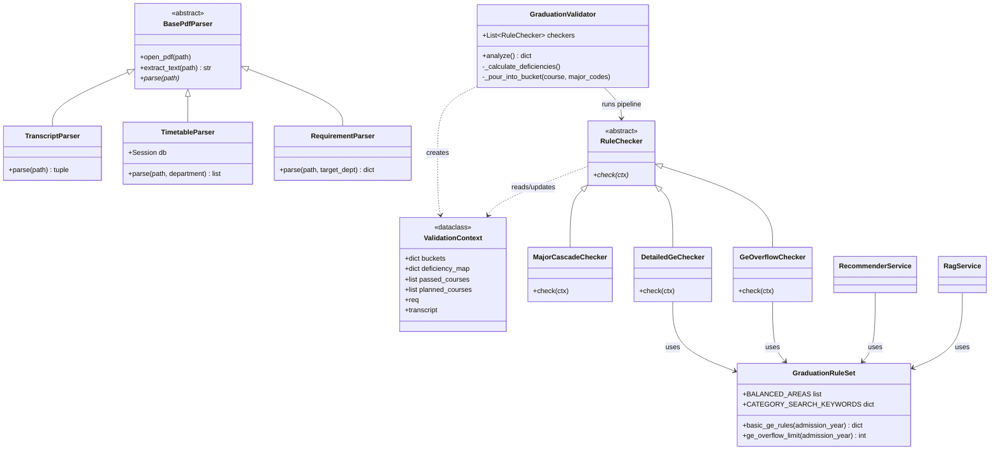

# uni-pass 발표 자료 (졸업 사정·과목 추천 시스템)

> MVP 기준: 핵심 기능(성적표 파싱 → 졸업 사정 → 부족 영역 추천 → **AI 시간표 추천 + RAG 근거**) 동작에 집중.

---

## 1. 시스템 개요 (Remind)

- **한 줄 정의**: 학생이 **성적표·시간표 PDF만 업로드**하면, 졸업 가능 여부를 자동 판정하고 부족한 영역을 채우는 **수강 과목·시간표를 추천**하는 FastAPI 백엔드.
- **해결하는 문제**: 강원대 졸업요건은 입학년도·전공별로 복잡(전공/교양/세부 필수영역). 수기 계산은 오류가 잦음 → 자동화. 나아가 "그래서 다음 학기에 뭘 들어야 하나?"까지 **시간 충돌 없는 시간표 + 학칙 근거가 담긴 추천 사유**로 답한다.
- **3-Layer 아키텍처**: `API(endpoints) → Service(비즈니스 로직) → Data(ORM/PostgreSQL)`
- **핵심 기능 4가지**
  1. **정밀 PDF 파싱**: 성적표/시간표/졸업요건 PDF에서 과목·학점·영역 추출 (pdfplumber 그리드 인식)
  2. **졸업 사정 엔진**: 학점을 9개 "바구니"에 담고 전공 폭포수·교양 초과·세부 필수영역 룰 검사
  3. **AI 시간표 추천 (하이브리드)**: 부족 영역 기반으로 시간 충돌 없는 추천 시간표 2~3안 생성. **코드가 하드 제약(충돌·학점)을 보장, LLM이 선택·순위·추천 사유 담당**
  4. **RAG 기반 추천 근거 ⭐ (신규)**: **pgvector 의미검색**(임베딩 코사인 유사도)으로 학칙·졸업요건을 검색해 LLM 추천 사유에 **실제 규정 근거**를 주입. 임베딩 키 없으면 **tsvector 키워드 검색으로 자동 폴백**
- **주요 API** (`app/api/endpoints/`)
  - `POST /api/transcript/parse` — 성적표 PDF → 기이수 과목
  - `POST /api/timetable/parse` — 시간표 PDF → 계획 과목
  - `POST /api/graduation/evaluate` — 졸업 사정 + 추천 통합 응답 (결과 DB 저장 포함)
  - `GET /api/graduation/requirements` — 졸업요건 PDF 파싱 결과 조회
  - `GET /api/students/{student_id}/history` — 과거 사정 이력 조회 *(기능 추가)*
  - `POST /api/timetable/recommend` — **AI 시간표 추천 (RAG + LLM)** *(기능 추가)*
  - `POST/GET /api/regulations` — **학칙·규정(RAG 데이터) 등록·조회** *(기능 추가)*

**데이터 흐름**: 성적표/시간표 PDF 업로드 → 파싱 → `GraduationValidator.analyze()` → `deficiency_map` 산출 → `TimetableRecommenderService.recommend()` (충돌 없는 후보 풀 생성 → `RagService`가 학칙 근거 검색 → `LLMClient`가 선택·사유 생성) → 추천 시간표 2~3안 반환

---

## 2. 시스템 클래스 다이어그램 (개선 전 / As-Is)



> **발표 포인트**: 서비스 계층은 분리돼 있으나 — ① 3개 파서가 공통 추상 없이 각자 pdfplumber 직접 사용, ② 사정 결과가 저장되지 않는 stateless 구조, ③ 졸업 규정 키워드가 두 곳에 중복 하드코딩, ④ 추천은 "과목 나열"에 그쳐 **시간 충돌·추천 근거가 없음** → 개선 동기.

---

## 3. 시스템 개선 사항

| # | 구분 | 개선 전 문제 | 개선 방향 | 구현 파일 |
|---|------|-------------|-----------|-----------|
| F1 | 기능 | `evaluate` 응답이 휘발됨. ORM 모델은 정의됐으나 **저장 로직 미연결** | 사정 결과 **영속화 + 이력 조회 API** | `services/report_service.py` |
| F2 | 기능 | 추천이 영역별 **과목 나열**에 그쳐, 시간 충돌·학점 범위·선택 근거가 없음 | **AI 시간표 추천(하이브리드)** — 코드가 충돌·학점 보장, LLM이 선택·사유 | `services/timetable_recommender.py`, `schedule.py`, `llm_client.py` |
| F3 | 기능 ⭐ | LLM 추천 사유가 **근거 없는 일반론**이 될 위험 (할루시네이션) | **RAG** — pgvector 의미검색(임베딩 코사인)으로 학칙·졸업요건 검색해 프롬프트에 **실제 규정 주입** (tsvector 폴백) | `services/rag_service.py`, `endpoints/regulations.py`, `utils/regulations_seeder.py` |
| R1 | 구조 | 파서 3종이 **공통 부모 없이** pdfplumber 중복 구현 | `BasePdfParser` 추상 클래스로 공통화 | `services/base_parser.py` |
| R2 | 구조 | 졸업 규정 키워드가 **validator·recommender 두 곳에 중복** | `GraduationRuleSet` 모듈로 단일화 (RAG 검색어도 재사용) | `services/rules.py` |
| R3 | 구조 | `analyze()`가 80줄 단일 메서드로 모든 룰 처리 | **RuleChecker 전략 파이프라인**으로 분리 (`checkers/` 패키지화) | `services/checkers/` |

---

## 4. 기능 추가 후 개선된 클래스 다이어그램

### 4.1 결과 영속화 (ReportService)

**추가된 것**: 기존에 정의만 돼 있던 `Student`/`AnalysisResult` ORM 모델을 연결해 사정 결과를 저장하고, 이력 조회 API를 추가.

```mermaid
classDiagram
    class EvaluateEndpoint {
        <<API>>
        +POST /api/graduation/evaluate
        +GET /api/students/{id}/history
    }
    class GraduationValidator {
        +analyze() dict
    }
    class RecommenderService {
        +recommend_courses(deficiency_map, dept) dict
    }
    class ReportService {
        +Session db
        +save_result(student_id, admission_year, requirement, analysis) AnalysisResult
        +get_history(student_id) list
        -_upsert_student(student_id, admission_year, major)
        -_get_or_create_requirement(req, admission_year)
    }
    class Student {
        +str student_id
        +str name
        +str major
        +int admission_year
    }
    class AnalysisResult {
        +UUID id
        +str student_id
        +UUID requirement_id
        +JSON result_json
        +JSON deficiency_map
        +datetime analyzed_at
    }
    class GraduationRequirementDB {
        +UUID id
        +str major
        +int admission_year
    }

    EvaluateEndpoint ..> GraduationValidator : analyze()
    EvaluateEndpoint ..> RecommenderService : recommend_courses()
    EvaluateEndpoint ..> ReportService : save_result() / get_history()
    ReportService --> Student : upsert
    ReportService --> GraduationRequirementDB : get or create
    ReportService --> AnalysisResult : persists
    Student "1" --> "*" AnalysisResult
    GraduationRequirementDB "1" --> "*" AnalysisResult
```

> **발표 포인트**: 새 코드를 짓기보다 **이미 존재하는 ORM 모델을 연결**해 기능을 추가. 오케스트레이션은 **엔드포인트(`evaluate`)**가 담당.

### 4.2 AI 시간표 추천 (하이브리드 LLM) & 4.3 RAG 추천 근거 ⭐

**핵심 설계 — "코드가 제약을 보장, LLM은 그 안에서만 선택"**:
- **코드(결정론)**: 부족 영역 후보 수집 → 여러 탐색 순서로 그리디 조합 → **시간 충돌·학점 범위 검증된 유효 시간표 풀** 생성 → 점수 정렬
- **RAG**: `RagService`가 `deficiency_map`을 쿼리로 임베딩해 **pgvector 의미검색**(코사인 유사도)으로 학칙·졸업요건을 찾아 **규정 근거 컨텍스트**를 만든다 (임베딩 불가 시 tsvector 키워드 폴백)
- **LLM**: 풀의 `index`만 골라 순위 매기고, RAG 컨텍스트를 근거로 **한국어 추천 사유** 작성
- **LLM 제공자 다중화**: OpenAI 우선 → 키 없으면 **Gemini** 자동 폴백 → 둘 다 없으면 비활성 (`LLMClient.provider`)
- **안전장치**: LLM 응답은 코드가 다시 검증(존재하지 않는 index 거부), **키 없거나 실패 시 결정론적 상위 N개로 폴백**(`llm_used=false`)



**RAG 동작 (pgvector 의미검색 우선 → tsvector 키워드 폴백)**



> **발표 포인트**:
> - **의미검색으로 업그레이드** — 기존 `tsvector('simple')`은 한국어 형태소 분석이 없어 `"글로벌"`로 `"글로벌의사소통"`을 못 찾는 등 **정확 토큰 일치만** 가능했음. → 쿼리를 **임베딩해 코사인 유사도**로 검색하니 동의어·문맥까지 매칭(`스키마의 VECTOR(1536)` 컬럼·pgvector 확장 활용).
> - **폴백 이중화** — 임베딩 키 없거나 의미검색 0건이면 **tsvector 키워드 검색**으로 자동 전환 → 외부 의존 없이도 RAG 동작 보장.
> - **할루시네이션 억제** — LLM은 "후보 index 중에서만 선택"하도록 제약하고, 추천 사유는 RAG로 가져온 **실제 학칙 스니펫을 근거로** 작성 → 그럴듯한 거짓말 방지.
> - **graceful degradation** — RAG 검색 0건이면 컨텍스트 섹션 자동 생략, LLM 실패·키 없음이면 결정론적 폴백. 어느 경로든 **항상 유효한 시간표를 반환**.

---

## 5. 리팩토링 이후 개선된 클래스 다이어그램 (구조 개선)

**리팩토링 3종** (동작 동일, 구조만 개선 — 기존 테스트로 회귀 검증):

- **R1 `BasePdfParser`**: `open_pdf()`/`extract_text()` 공통화 → 3개 파서가 상속
- **R2 `GraduationRuleSet`**: 입학년도별 기초/균형교양 키워드·목표학점을 한 곳에 — Validator·Recommender·**RagService**가 공유
- **R3 RuleChecker 분리**: `analyze()`의 거대 로직을 3개 체커 전략으로 분해



> **발표 포인트**: `analyze()`가 `ValidationContext`를 만들어 각 `RuleChecker.check(ctx)`에 전달 → 체커들이 공유 컨텍스트를 읽고 갱신. 새 졸업 규정이 생겨도 `RuleChecker` 하나만 추가하면 됨(개방-폐쇄 원칙). **`GraduationRuleSet`는 이제 Validator·Recommender·RagService 세 곳이 공유** — 사정·추천·RAG 검색의 용어가 단일 출처로 정렬됨.

---

## 6. 테스트 케이스 & 통과 현황

**프레임워크**: pytest (`pyproject.toml`, `pythonpath=["."]`)

### 테스트 구성 — 54개 수집 (12개 파일)

**(1) 졸업 사정·AI 추천·RAG — 발표 핵심 기여**

| 파일 | 개수 | 검증 영역 |
|------|:---:|-----------|
| `test_validator.py` | 4 | 전공 부족·폭포수, 꿈-설계 미이수, F/NP 제외 |
| `test_validator_updated.py` | 5 | 교양 초과→자유선택(소멸), 코드 기반 전공 인정, 입학년도별 룰 |
| `test_report_service.py` | 5 | 결과 DB 저장, DB 오류 graceful, 이력 포맷, 신규 학생 자동 생성 |
| `test_schedule.py` | 11 | 시간 문자열 파싱(요일 상속·중첩 괄호 건물명), 충돌 검사, 호실 추출 |
| `test_timetable_recommender.py` | 8 | 충돌·중복 배제, 학점 범위, 영역 최대 커버, **LLM 선택·사유**, **잘못된 index 폴백**, taken 제외 |
| `test_llm_client.py` | 2 | **OpenAI 키 없을 때 Gemini 폴백**, 두 키 모두 없으면 `enabled=False` |
| `test_rag_service.py` ⭐ | 4 | **의미검색 매핑**, **임베딩 비활성 시 DB 미접근**, **의미검색 0건 → 키워드 폴백**, DB 오류 시 빈 결과+rollback |

**(2) PDF 파서·데이터 — 팀 통합**

| 파일 | 개수 | 검증 영역 |
|------|:---:|-----------|
| `test_transcript_parsing.py` | 2 | 성적표 텍스트 파싱(IT대학·이수구분 alias) + E2E 1건(샘플 PDF 없으면 skip) |
| `test_timetable_parser.py` | 2 | DB 없을 때 CSV 카탈로그 폴백, PDF 업로드 파싱 |
| `test_earned_credit.py` | 8 | 취득학점 계산·전공 초과 이월·카탈로그 우선순위 |
| `test_cse_curriculum.py` | 1 | 컴공 커리큘럼 HTML → 과목코드·영역 매핑 |
| `test_department_normalization.py` | 2 | 학과명 정규화(단과대 접두 제거) |

> **AI 추천·RAG 검증 전략**: `FakeLLM`으로 LLM 의존성을 격리해 **세 경로를 모두 검증** — ① 정상 LLM 선택(`llm_used=true`), ② 존재하지 않는 index 반환 시 **결정론적 폴백**(`llm_used=false`), ③ 키 없음 폴백. 코드가 보장하는 하드 제약(충돌 없음·학점 범위·과목 중복 없음)은 LLM 사용 여부와 무관하게 항상 성립함을 단언. **RAG·LLM은 외부 의존(PostgreSQL·임베딩/생성 API)을 가짜 세션/가짜 LLM으로 격리해 단위 테스트화** — `test_rag_service.py`는 **의미검색 결과 매핑**·**임베딩 비활성 시 DB 미접근**·**의미검색 0건 시 tsvector 키워드 폴백**·DB 장애 graceful을, `test_llm_client.py`는 OpenAI→Gemini 폴백 분기를 단언. 실제 pgvector 임베딩 매칭은 **시드+임베딩 backfill(`regulations_seeder`) → 검색 → `/api/timetable/recommend` 라이브 데모**로 보완.

### 최종 결과

```
53 passed, 1 skipped, 0 failed  ✅
리팩토링 전후 기존 테스트 동일 통과 → 회귀 없음
```

> `1 skipped`은 성적표 E2E(`test_transcript_parsing_e2e`)로, `data/`에 샘플 PDF가 있어야 실행됨(없으면 자동 skip). 즉 **수집 54개 = 통과 53 + skip 1**.

**테스트 전략**: 입력 분할(입학년도 2019/2021/2022), 경계값(교양 초과 10학점, 학점 범위), 폭포수 캐스케이드, 예외(2019 미만 `ValueError`), DB Mock(`SQLAlchemyError` 포함), **LLM Mock(정상/오류/부재 3분기 + Gemini 폴백)**.

---

## 7. 최종 프로그램 시연 (Demo)

**시연 스크립트** (`scripts/demo_capture.py`)

```powershell
$env:PYTHONPATH = "."
python scripts/demo_capture.py all
# 또는 개별: transcript / requirements / timetable / analysis
```

**RAG 데이터 시드 (시연 전 1회)**

```powershell
$env:PYTHONPATH = "."
python -m app.utils.regulations_seeder
# data/regulations_seed.json (학칙 산문) + raw_requirements/*.pdf (학과별 요건) → regulations 테이블
# 이어서 backfill_embeddings()가 각 규정을 임베딩해 embedding 컬럼 채움 (의미검색용)
# OPENAI_API_KEY 없으면 임베딩은 skip되고 tsvector 키워드 검색으로 동작
```

**시연 시나리오 (MVP 핵심 경로)**

| 순서 | 데모 | 입력 | 출력 |
|------|------|------|------|
| 1 | 성적표 파싱 | `test_data/grade.pdf` | 학번·소속·기이수 과목 목록 |
| 2 | 졸업요건 파싱 | `data/raw_requirements/*.pdf` | 영역별 요구 학점 |
| 3 | 졸업 사정 | 위 1~2 결과 | buckets / deficiency_map (부족 영역) |
| 4 | **AI 시간표 추천 (RAG)** | 사정 결과 + 추천 옵션 | **충돌 없는 시간표 2~3안 + 학칙 근거 추천 사유** (`llm_used` 표기) |

**API 라이브 데모**
```powershell
$env:PYTHONPATH = "."; uvicorn app.main:app --reload
# http://localhost:8000/docs
#   1) POST /api/regulations 로 학칙 등록 (또는 시더 사용)
#   2) POST /api/timetable/recommend → timetables[].rationale 에 RAG 근거가 녹은 추천 사유 확인
#   3) (LLM 키 없으면 llm_used=false 로 결정론적 폴백 — 그래도 유효 시간표 반환)
```

> **시연 강조점**: 같은 부족 영역이라도 RAG가 주입한 **학칙 스니펫에 근거한 추천 사유**가 나온다는 점, 그리고 LLM 키 유무와 무관하게 **항상 시간 충돌 없는 유효 시간표가 보장**된다는 점(`llm_used` 플래그로 경로 가시화).

---

## 발표 흐름 요약

```
1. 시스템 개요 (핵심 4기능: 파싱·사정·AI추천·RAG)
      ↓
2. As-Is 클래스 다이어그램 (개선 전 구조)
      ↓
3. 개선 사항 (기능 F1~F3 + 구조 R1~R3)
      ↓
4. 기능 추가 다이어그램
     4.1 ReportService (결과 영속화)
     4.2/4.3 AI 시간표 추천 + RAG 근거 ⭐
      ↓
5. 리팩토링 다이어그램 (BasePdfParser / GraduationRuleSet / RuleChecker)
      ↓
6. 테스트 53 통과 / 1 skip — 회귀 없음 + RAG 의미검색·LLM(Gemini 폴백) 단위 검증
      ↓
7. 라이브 시연 (RAG 근거 추천 사유 + 폴백 보장)
```
